# home-assistant-icons
Custom Icons for Home Assistant

If you are like me and love icons that better represent the actual state of your home automation devices.  I would like to share some icons I have customized for just that.

## Venetian blinds icons.
How the icons look:
<br/>
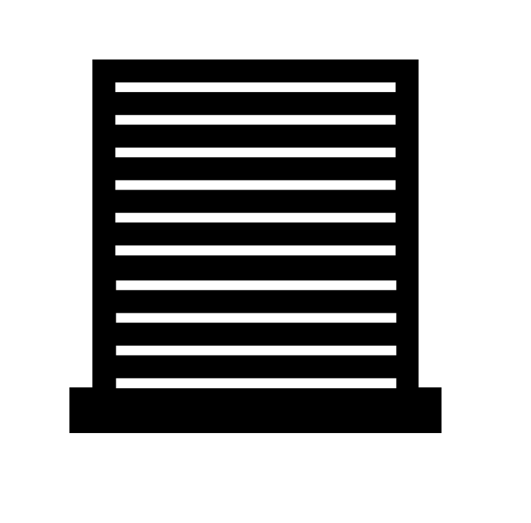
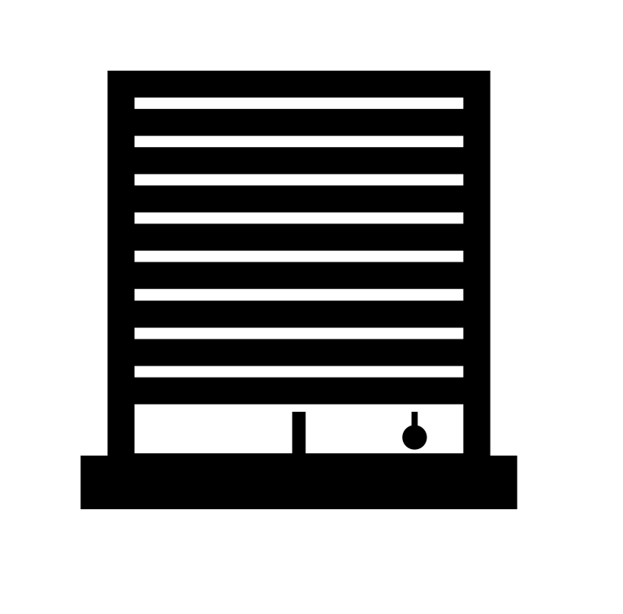
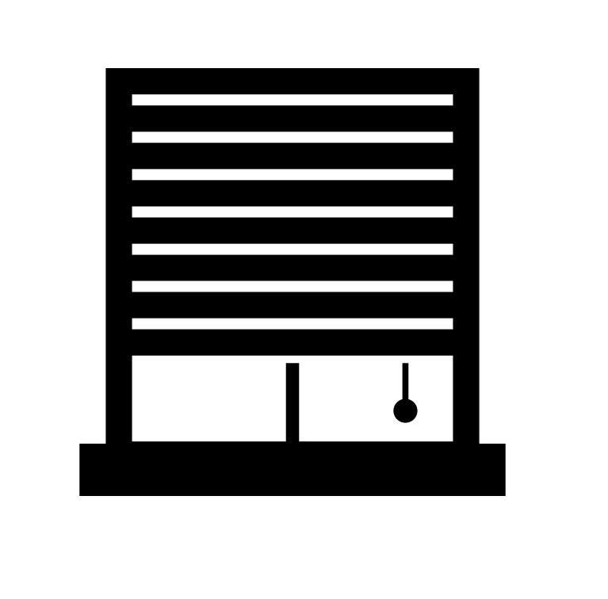
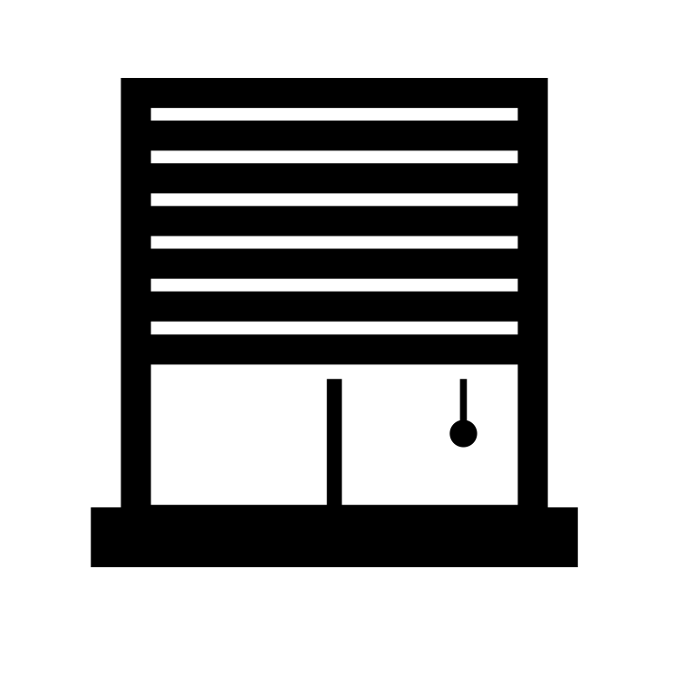
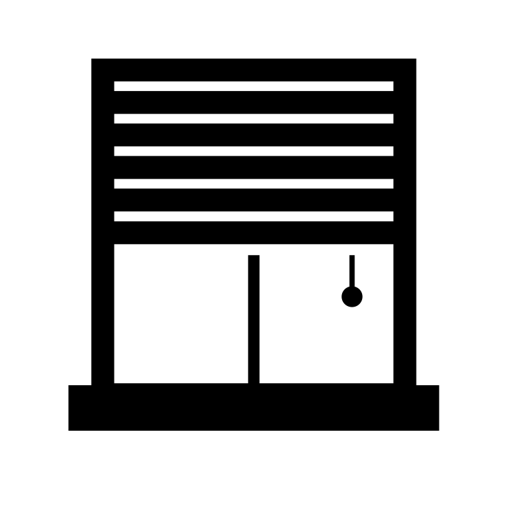
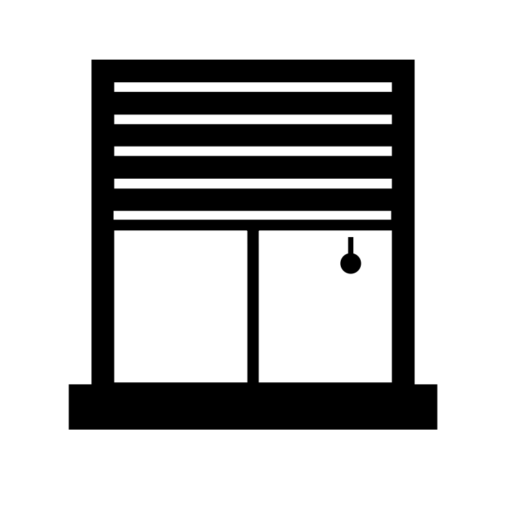
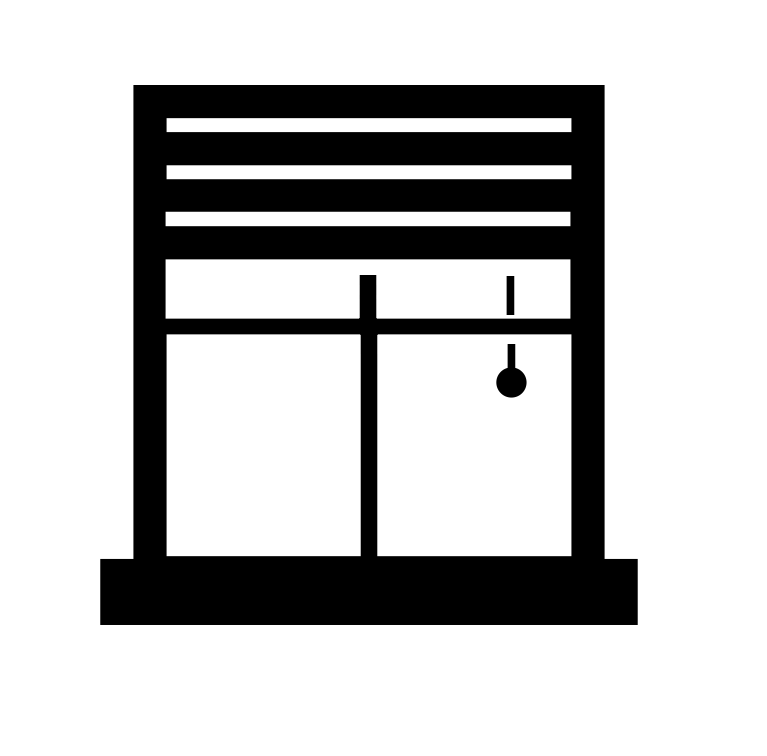
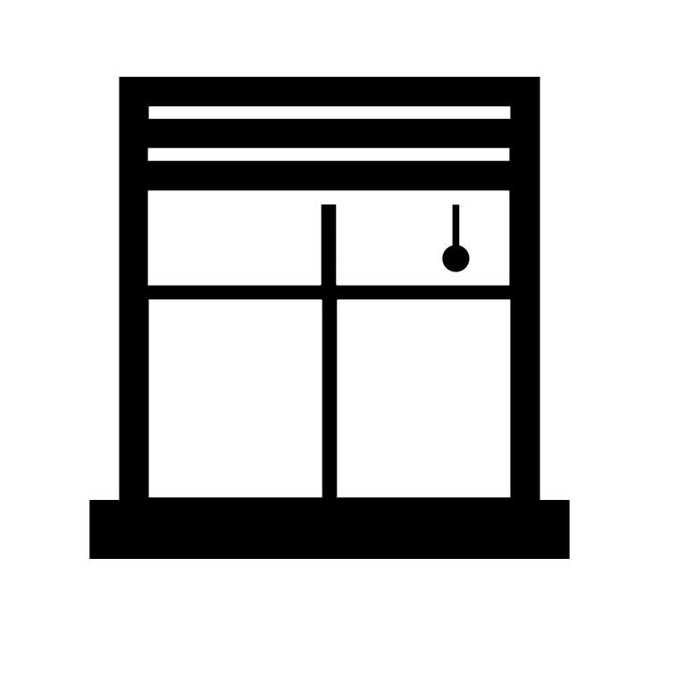
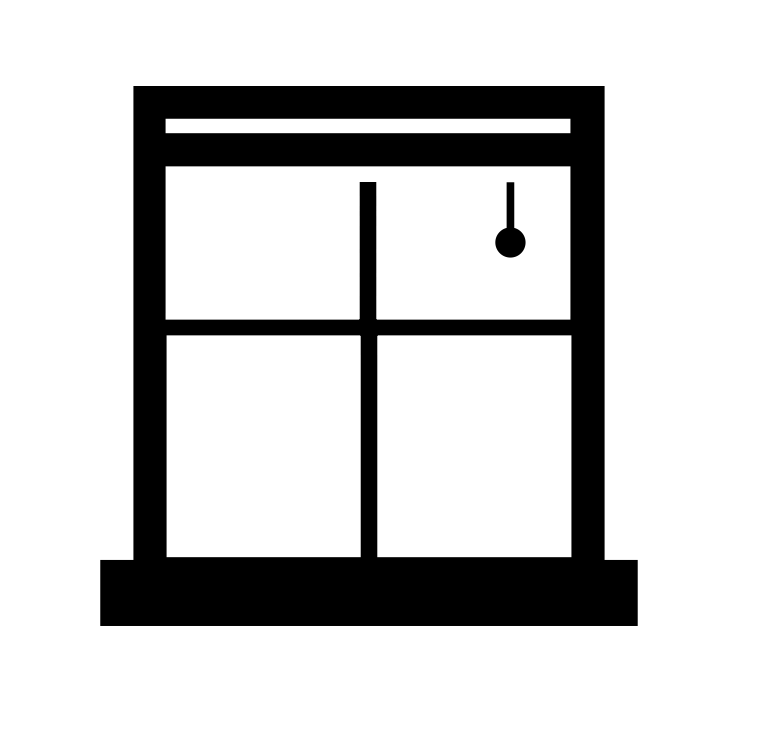
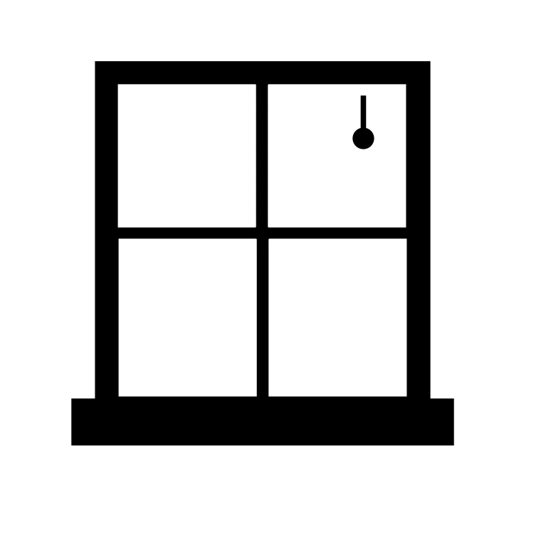
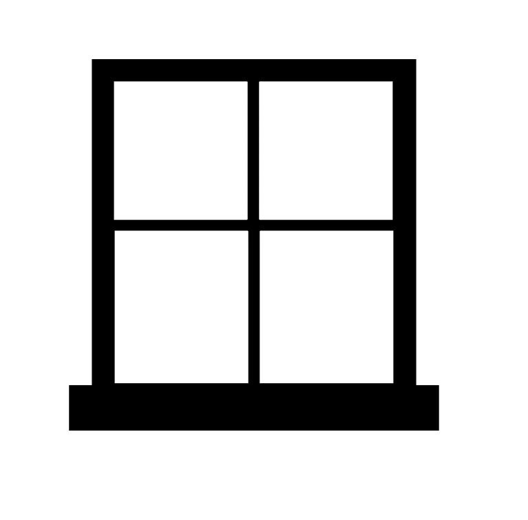

How they can look in Home Assistant
<br/>
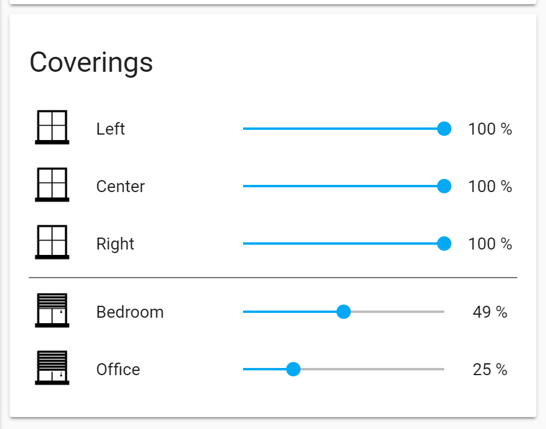

How I set them up in Home Assistant
```yaml
#Example setup

#customize_global.yaml

#windows
"cover.*_window_*":
  templates:
    entity_picture: >
      if (state === 'closed') return '/local/blinds_00.png';
      if (attributes.current_position <= 10) return '/local/blinds_10.png';
      if (attributes.current_position <= 20) return '/local/blinds_20.png';
      if (attributes.current_position <= 30) return '/local/blinds_30.png';
      if (attributes.current_position <= 40) return '/local/blinds_40.png';
      if (attributes.current_position <= 50) return '/local/blinds_50.png';
      if (attributes.current_position <= 60) return '/local/blinds_60.png';
      if (attributes.current_position <= 70) return '/local/blinds_70.png';
      if (attributes.current_position <= 80) return '/local/blinds_80.png';
      if (attributes.current_position <= 90) return '/local/blinds_90.png';
      return '/local/blinds_99.png';
```
Note:
My setup using custom_ui for home assistant to allow me to set all of my convering to use icon configuration.

Thanks to:
- Tim Madle for making the original icon
